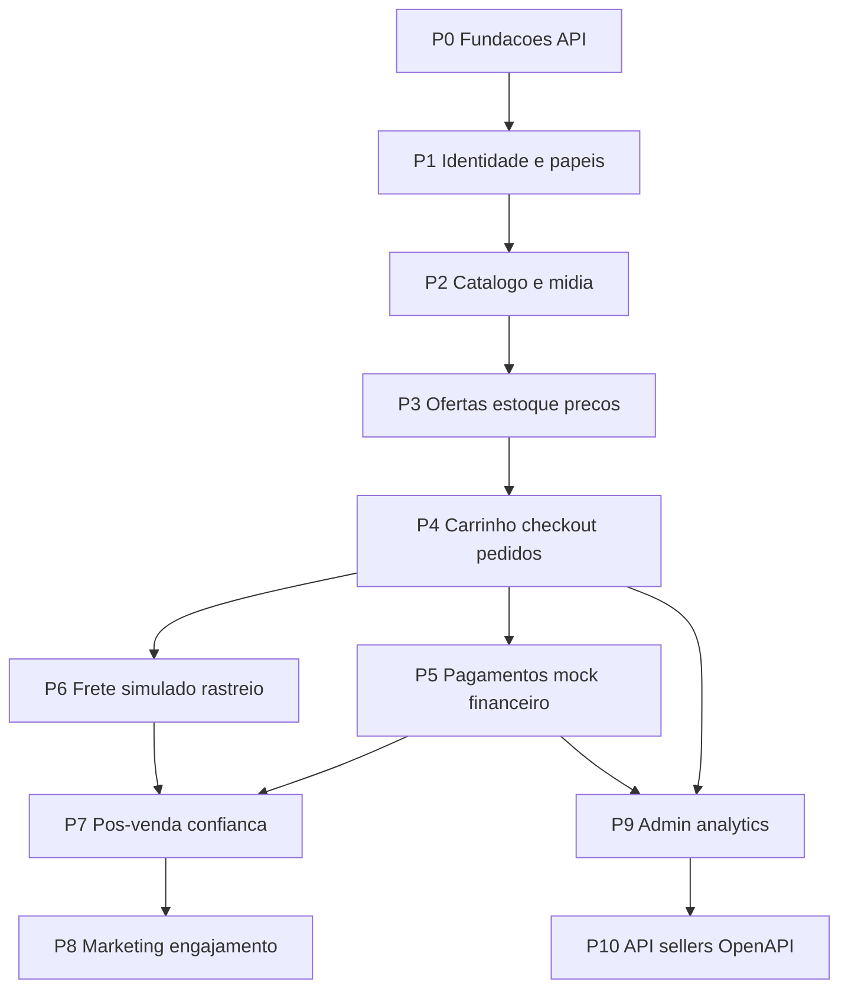

# Roadmap de Implementação — API Marketplace

Documento de referência para implementação da API de um marketplace híbrido (plataforma + vendedores terceiros), inspirado em plataformas como Mercado Livre, Amazon, Magalu, Kabum e Pichau, em proporção adequada a um projeto de portfólio/aprendizado.

**Stack:** PHP 8.4 · Laravel 12 · Sanctum · PostgreSQL · Redis (filas)  
**Prefixo de API:** `/api/v1`  
**Objetivo:** portfólio / aprendizado (sem prazo fixo)

---

## 1. Visão e decisões confirmadas

| Tema                | Decisão                                                                      |
| ------------------- | ---------------------------------------------------------------------------- |
| Modelo              | Híbrido: plataforma vende + sellers terceiros                                |
| Pagamento           | Plataforma cobra o comprador e repassa ao seller (split + comissão)          |
| Gateway real        | **Não** no início — apenas simulação/mock                                    |
| Frete               | Tabelado interno (peso, dimensões, quantidade, distância/CEP) — **simulado** |
| Transportadoras     | Sem integração real no início                                                |
| Fulfillment físico  | Adiado (irrelevante enquanto frete for simulado)                             |
| Geografia           | Somente Brasil                                                               |
| Público             | B2C e B2B                                                                    |
| Papéis              | Comprador, vendedor, admin                                                   |
| Onboarding seller   | Aprovação manual + KYC                                                       |
| Carrinho anônimo    | **Não**                                                                      |
| Fidelidade / pontos | **Não**                                                                      |
| Paginação           | Cursor                                                                       |
| Soft delete         | Em todos os recursos                                                         |
| IDs                 | UUID em todos os recursos                                                    |
| Versionamento       | Manter apenas `/api/v1` por enquanto                                         |

### Estado atual do repositório

Já existe:

- Auth Sanctum com access/refresh tokens (`abilities: access` / `refresh`)
- Rotas em `[routes/api.php](../routes/api.php)`: login, register, logout, refresh, `GET /users/me`
- `[app/Services/AuthService.php](../app/Services/AuthService.php)`, Form Requests, `UserResource`
- Docker Compose com app + PostgreSQL 17
- Usuário com UUID (`HasUuids`)

Ainda **não** existe: papéis, catálogo, estoque, pedidos, pagamentos, frete, pós-venda, admin operacional, OpenAPI, Redis/workers, Policies, feature tests de domínio.

---

## 2. Fora de escopo inicial

Não implementar nestas fases (pode ser revisitado depois):

- Gateway de pagamento real (Mercado Pago, Stripe, PagSeguro etc.)
- Integração real com Correios / Melhor Envio / outras transportadoras
- Fulfillment físico da plataforma (CD próprio)
- Carrinho guest / merge no login
- Programa de pontos / fidelidade
- Multi-país, multi-moeda, i18n de catálogo
- Nota fiscal eletrônica real (apenas dados fiscais **simulados** no pedido)

---

## 3. Diagrama de dependências entre fases

**Regra prática:** não avance de fase sem cumprir os critérios de “pronto” da fase anterior na cadeia crítica (P0 → P4). P5 e P6 podem avançar em paralelo após P4. P7 depende de pedido pago/enviável (P5 + P6 no mínimo básicos).

---

## 4. Convenções transversais de engenharia

Checklist permanente — aplicar em **todas** as fases:

| Convenção    | Padrão                                                                      |
| ------------ | --------------------------------------------------------------------------- |
| Sucesso      | `{ "data": { ... } }` (coleções paginadas com `data` + metadados de cursor) |
| Erro         | `{ "message": "...", "errors": { "campo": ["..."] } }`                      |
| HTTP         | 200 / 201 / 204 / 401 / 403 / 404 / 409 / 422 / 429 conforme o caso         |
| Controllers  | Finos — delegar a Actions/Services                                          |
| Validação    | Form Requests                                                               |
| Resposta     | API Resources — nunca Model cru                                             |
| Autorização  | Policies / Gates — nunca só no cliente                                      |
| Persistência | Soft deletes + UUID                                                         |
| Coleções     | Paginação cursor                                                            |
| Async        | Jobs em fila Redis (e-mail, webhooks, imagens, notificações)                |
| Testes       | Feature tests por domínio + factories/seeders ricos                         |
| Segredos     | Nunca em logs, commits ou respostas                                         |
| LGPD         | Minimizar PII; mascarar em logs; cuidado com KYC e dados bancários          |

### Operações que exigem cuidado especial

| Operação                      | Cuidados                                                          |
| ----------------------------- | ----------------------------------------------------------------- |
| Checkout / reserva de estoque | `DB::transaction`, lock pessimista ou equivalente, race condition |
| Pagamento / webhook           | Idempotência (chave única), estados válidos apenas                |
| Cancelamento / reembolso      | Transação + estorno de estoque + ledger                           |
| Repasse / payout              | Ledger imutável (append-only), nunca “editar saldo”               |
| Moderação / KYC               | Auditoria de quem aprovou/rejeitou e quando                       |

---

## 5. Fases de implementação

### P0 — Fundações da API

**Objetivo:** padronizar a base antes de crescer o domínio marketplace.

**Entregáveis**

- Envelope de erro consistente (concluir/corrigir stub `ApiErroResponse` / handler de exceções)
- Trait ou base Model: UUID + soft deletes como padrão do projeto
- Helper/trait de paginação cursor reutilizável
- Redis + worker de queue no `compose.yml`
- Feature tests cobrindo auth atual (login, register, logout, refresh, `me`, throttle)
- Alinhar `.env.example` com Postgres (se ainda apontar sqlite)

**Entidades:** nenhuma nova de negócio.

**Critérios de pronto**

- [ ] Erros 422/401/403/404 no formato acordado
- [ ] Redis sobe no Docker e `queue:work` processa um Job de exemplo
- [ ] Testes de auth passando
- [ ] Documentado no README como subir app + db + redis + worker

**Riscos:** baixo. Evita refatoração cara depois.

---

### P1 — Identidade, papéis e onboarding

**Objetivo:** quem é o usuário, o que pode fazer, e como vira seller.

**Entregáveis de API (exemplos)**

- Papéis: `buyer`, `seller`, `admin` (um usuário pode acumular buyer + seller)
- Verificação de e-mail (todos os perfis)
- Recuperação de senha
- Login social (candidato: Laravel Socialite — Google no mínimo)
- Solicitação de seller + KYC (documentos, dados bancários) + aprovação/rejeição por admin
- Rate limiting reforçado em login, register, reset e endpoints sensíveis
- Policies básicas por papel

**Entidades sugeridas**

- `roles` / `role_user` (ou enum + pivot)
- `seller_profiles` (status: pending/approved/rejected/suspended)
- `kyc_documents` (metadados + path storage; nunca logar conteúdo)
- Campos de verificação em `users` (`email_verified_at` já padrão Laravel)
- Tokens/password reset (já parcialmente no Laravel)

**Regras críticas**

- Seller só cria anúncios/ofertas após `approved`
- Dados KYC e bancários: acesso restrito (owner + admin)
- Login social não deve sobrescrever senha local sem fluxo explícito

**Testes**

- Não autenticado / sem papel / seller pendente / admin aprova KYC
- Verificação de e-mail bloqueia ações sensíveis se assim for definido

**Critérios de pronto**

- [ ] Três papéis funcionando com Policies
- [ ] Fluxo seller: request → KYC → approve/reject
- [ ] E-mail verification + password reset + social login
- [ ] Throttle/antifraude básico documentado

**Cuidados:** autenticação, autorização, dados pessoais (LGPD).

---

### P2 — Catálogo e mídia

**Objetivo:** descoberta de produtos e estrutura de anúncios.

**Entregáveis de API**

- CRUD de categorias hierárquicas (admin)
- Atributos dinâmicos por categoria
- Produtos (canônicos) + anúncios/listings ligados ao seller ou à plataforma
- Upload de múltiplas imagens (storage + Job de processamento se necessário)
- Status: draft / active / paused / rejected (moderação admin)
- Loja pública do vendedor
- Busca textual, filtros (preço, categoria, marca, seller) e ordenação
- Listagem pública paginada (cursor)

**Entidades sugeridas**

- `categories`, `category_attributes`
- `products` (catálogo canônico)
- `product_images`
- `stores` / perfil público do seller
- Campos de moderação (`moderated_by`, `moderated_at`, `rejection_reason`)

**Regras críticas**

- Seller só edita o que é dele (Policy + escopo)
- Anúncio rejeitado não aparece na busca pública
- Soft delete não quebra FKs de histórico futuro (pedidos)

**Testes**

- CRUD autorizado, moderação, busca/filtros, isolamento entre sellers

**Critérios de pronto**

- [ ] Catálogo navegável publicamente
- [ ] Seller gerencia próprios produtos
- [ ] Admin modera
- [ ] Imagens persistidas e expostas via Resource

---

### P3 — Ofertas, estoque e preços

**Objetivo:** o mesmo produto canônico pode ter várias ofertas (Buy Box); estoque seguro.

**Entregáveis de API**

- Variações / SKUs (cor, tamanho etc.)
- Ofertas por seller (`offers`): preço, estoque, prazo de envio, status
- Preço promocional (de/por) com vigência
- Seleção da oferta “vencedora” para exibição (regra simples documentada: menor preço + estoque + reputação futura)
- Reserva de estoque preparada para checkout (serviço de inventário)

**Entidades sugeridas**

- `product_variants` / `skus`
- `offers` (`product_id` ou `variant_id`, `seller_id`, `price`, `promotional_price`, `stock`)
- `inventory_reservations` (ou campos `stock` + `reserved` na offer)

**Regras críticas**

- Nunca decrementar estoque só no controller sem transação
- Preço exibido ≠ preço cobrado no pedido (pedido congela preço na P4)
- Oferta da plataforma usa o mesmo modelo (seller “platform” ou flag)

**Testes**

- Concorrência básica de reserva (dois checkouts no mesmo SKU)
- Oferta pausada não entra no carrinho

**Critérios de pronto**

- [ ] Multi-oferta por produto
- [ ] Estoque com reserva testável
- [ ] Preço promocional aplicado na listagem/detalhe

**Cuidados:** integridade de estoque e concorrência.

---

### P4 — Carrinho, checkout e pedidos

**Objetivo:** jornada de compra multi-seller com preços históricos.

**Entregáveis de API**

- Carrinho **somente autenticado** (sem guest)
- Endereços de entrega do usuário
- Checkout → cria pedido + subpedidos por seller
- Itens com **preço unitário histórico**, nome, SKU snapshot
- Máquina de estados do pedido/subpedido (ex.: `pending_payment` → `paid` → `processing` → `shipped` → `delivered` / `cancelled` / `refunded`)
- Cancelamento por comprador, seller ou admin (regras por estado)
- Dados fiscais **simulados** no pedido (CNPJ/CPF, inscrição — sem NFS-e real)

**Entidades sugeridas**

- `carts`, `cart_items`
- `addresses`
- `orders`, `order_sellers` (subpedidos), `order_items`
- `order_status_histories`
- Snapshots fiscais/endereço no pedido

**Regras críticas**

- Transação cobrindo: validar ofertas, reservar estoque, criar pedido, limpar carrinho
- Pedido multi-seller: um `order` pai, N `order_sellers`
- Transições de status explícitas (enum + guard clauses) — sem “set status” livre
- Idempotência do checkout (chave do cliente ou hash do carrinho + user)

**Testes**

- Checkout feliz, estoque insuficiente (409), não autenticado, cancelamentos por papel, snapshot de preço

**Critérios de pronto**

- [ ] Carrinho → pedido multi-seller
- [ ] Preços históricos corretos
- [ ] FSM documentada e testada
- [ ] Endereço e dados fiscais simulados persistidos

**Cuidados:** estoque, pedido, dados pessoais, concorrência.

---

### P5 — Pagamentos mock e financeiro

**Objetivo:** simular Pix, cartão e boleto com webhooks, comissão, ledger e payouts — sem gateway real.

**Entregáveis de API**

- Iniciar pagamento (`pix` | `credit_card` | `boleto`) → retorna payload mock
- Endpoint de webhook simulado (e Job que processa)
- Idempotência por `payment_intent_id` / `idempotency_key`
- Reembolso total e parcial
- Comissão da plataforma configurável
- Ledger de movimentos (crédito seller, comissão, estorno)
- Payouts/saques agendados (status: requested / paid / failed) — valores derivados do ledger

**Entidades sugeridas**

- `payments`, `payment_webhook_events`
- `refunds`
- `ledger_entries`
- `payouts`
- `platform_fee_rules`

**Regras críticas**

- Webhook duplicado não altera estado duas vezes
- Só marca pedido `paid` após evento confirmado (mock)
- Ledger append-only; saldo = soma das entradas
- Logs sem PAN/CVV (mesmo em mock, não inventar dados sensíveis reais)

**Testes**

- Fluxos dos 3 métodos, webhook duplicado, reembolso, cálculo de comissão, payout

**Critérios de pronto**

- [ ] Pagamento mock fecha o ciclo até `paid`
- [ ] Comissão e ledger coerentes
- [ ] Reembolso atualiza pedido + ledger + estoque quando aplicável

**Cuidados:** integridade financeira, idempotência, autorização.

---

### P6 — Frete simulado e rastreio

**Objetivo:** cotar frete e acompanhar envio sem transportadora real.

**Entregáveis de API**

- Tabela/regras internas: peso, altura/largura/profundidade, quantidade, distância (CEP origem → destino)
- Cotação no checkout por subpedido
- Código de rastreio por subpedido (gerado/simulado)
- Atualização de status de envio (seller/admin) alinhada à FSM

**Entidades sugeridas**

- `shipping_rate_rules` ou motor em config + tabela
- `shipments` (`tracking_code`, `carrier` = `simulated`, valores, prazos)

**Regras críticas**

- Frete calculado e **congelado** no pedido (não recalcular depois mudando o histórico)
- CEP inválido → 422

**Testes**

- Cotação determinística com fixtures de CEP/peso
- Tracking por subpedido

**Critérios de pronto**

- [ ] Checkout inclui frete simulado
- [ ] Tracking visível ao comprador e ao seller

---

### P7 — Pós-venda e confiança

**Objetivo:** reputação, suporte e resolução de conflitos.

**Entregáveis de API**

- Avaliação de produto (somente após compra entregue/concluída)
- Reputação do vendedor (agregado das avaliações/pedidos)
- Perguntas e respostas no anúncio
- Chat comprador–vendedor (mensagens; preferir Jobs para notificar)
- Devoluções / RMA
- Disputas com mediação admin
- Wishlist / favoritos

**Entidades sugeridas**

- `product_reviews`, `seller_ratings`
- `product_questions`, `product_answers`
- `conversations`, `messages`
- `return_requests`, `disputes`
- `wishlists` / `wishlist_items`

**Regras críticas**

- Review só de quem comprou o item (anti-fraude de reputação)
- Disputa trava ações conflitantes (ex.: payout) até resolução — documentar regra
- Chat: autorização estrita (só participantes + admin)

**Testes**

- Review sem compra → 403
- Fluxo devolução → reembolso (integração com P5)
- Isolamento de conversas

**Critérios de pronto**

- [ ] Reviews e reputação
- [ ] Q&A, chat, wishlist
- [ ] Devolução e disputa com admin

**Cuidados:** autorização (IDOR), dados pessoais em mensagens, impacto financeiro.

---

### P8 — Marketing e engajamento

**Objetivo:** conversão e retenção leve (sem programa de pontos).

**Entregáveis de API**

- Cupons / vouchers (percentual, valor fixo, validade, limites)
- Regra de frete grátis
- Ads internos (anúncios patrocinados / boost de listagem)
- Notificações e-mail (fila)
- Notificações push / in-app (modelo + fila; provider push pode ser mock)

**Entidades sugeridas**

- `coupons`, `coupon_redemptions`
- `free_shipping_rules`
- `sponsored_placements` / `ads_campaigns`
- `notifications`, `device_tokens` (se push)

**Regras críticas**

- Cupom aplicado no checkout com validação atômica (uso único / limite)
- Ads não quebram ordenação orgânica sem flag explícita na API

**Testes**

- Cupom expirado/inválido/já usado
- Frete grátis por regra
- Job de e-mail disparado em eventos-chave (pedido pago, etc.)

**Critérios de pronto**

- [ ] Cupom + frete grátis no checkout
- [ ] Ads listáveis
- [ ] E-mail e notificação in-app via fila

---

### P9 — Admin, analytics e auditoria

**Objetivo:** operação da plataforma e observabilidade de negócio.

**Entregáveis de API**

- Endpoints admin: users, sellers, produtos, pedidos, pagamentos, disputas
- Relatórios básicos: vendas, comissão, cancelamentos, conversão simples
- Auditoria de ações sensíveis (aprovação KYC, reembolso, mudança de papel, moderação)

**Entidades sugeridas**

- `audit_logs` (`actor_id`, `action`, `auditable_*`, `payload` sanitizado, `ip`)

**Regras críticas**

- Tudo admin atrás de Policy `admin`
- Relatórios: queries agregadas com índices; evitar N+1
- Audit log sem senha, token, documento completo quando possível (mascarar)

**Testes**

- Buyer/seller não acessam rotas admin
- Eventos sensíveis geram audit log

**Critérios de pronto**

- [ ] API admin utilizável para ops do MVP
- [ ] Relatórios mínimos
- [ ] Auditoria nas ações críticas

---

### P10 — API de sellers, webhooks e OpenAPI

**Objetivo:** integração externa e contrato documentado.

**Entregáveis**

- API seller para catálogo, estoque, pedidos, envios (escopos/tokens próprios ou abilities Sanctum)
- Webhooks para sellers (novo pedido, cancelamento, disputa) com assinatura HMAC e retentativas via Job
- OpenAPI / Swagger da API pública e seller
- Seeders/factories ricos para demo completa do marketplace

**Regras críticas**

- Webhooks: retry com backoff; não enviar PII desnecessária
- Tokens seller com least privilege
- OpenAPI alinhado ao comportamento real dos testes

**Critérios de pronto**

- [ ] Seller integra sem usar rotas “humanas” do app
- [ ] Webhook entregue (ou mock receiver nos testes)
- [ ] Spec OpenAPI publicada (arquivo ou UI)

---

## 6. Mapa questionário → fase

| #   | Item                              | Fase                | Status                                 |
| --- | --------------------------------- | ------------------- | -------------------------------------- |
| 1   | Modelo híbrido                    | —                   | Decisão                                |
| 2   | Split + comissão                  | P5                  | MVP (mock)                             |
| 3   | Frete seller e/ou plataforma      | P6                  | Simulado                               |
| 4   | Só Brasil                         | —                   | Decisão                                |
| 5   | B2C + B2B                         | P1/P4               | MVP (perfis; regras B2B podem evoluir) |
| 6   | Papéis buyer/seller/admin         | P1                  | MVP                                    |
| 7   | Aprovação manual seller           | P1                  | MVP                                    |
| 8   | KYC                               | P1                  | MVP                                    |
| 9   | Verificação de e-mail             | P1                  | MVP                                    |
| 10  | Recuperação de senha              | P1                  | MVP                                    |
| 11  | Login social                      | P1                  | MVP                                    |
| 12  | Rate limit / antifraude básico    | P0/P1               | MVP                                    |
| 13  | Categorias hierárquicas           | P2                  | MVP                                    |
| 14  | Variações / SKUs                  | P3                  | MVP                                    |
| 15  | Atributos dinâmicos               | P2                  | MVP                                    |
| 16  | Imagens múltiplas                 | P2                  | MVP                                    |
| 17  | Status do anúncio                 | P2                  | MVP                                    |
| 18  | Busca textual                     | P2                  | MVP                                    |
| 19  | Filtros                           | P2                  | MVP                                    |
| 20  | Ordenação                         | P2                  | MVP                                    |
| 21  | Loja do vendedor                  | P2                  | MVP                                    |
| 22  | Moderação admin                   | P2                  | MVP                                    |
| 23  | Estoque por SKU                   | P3                  | MVP                                    |
| 24  | Reserva no checkout               | P3/P4               | MVP                                    |
| 25  | Preço promocional                 | P3                  | MVP                                    |
| 26  | Ofertas multi-seller (Buy Box)    | P3                  | MVP                                    |
| 27  | Preço histórico no pedido         | P4                  | MVP                                    |
| 28  | Carrinho logado                   | P4                  | MVP                                    |
| 29  | Carrinho anônimo                  | —                   | **Excluído**                           |
| 30  | Endereço no checkout              | P4                  | MVP                                    |
| 31  | Pedido multi-seller               | P4                  | MVP                                    |
| 32  | FSM de status                     | P4                  | MVP                                    |
| 33  | Cancelamento (buyer/seller/admin) | P4                  | MVP                                    |
| 34  | Dados fiscais                     | P4                  | Simulado                               |
| 35  | Pix / cartão / boleto             | P5                  | Mock                                   |
| 36  | Gateway real                      | —                   | **Excluído** (só mock)                 |
| 37  | Webhooks pagamento                | P5                  | Mock                                   |
| 38  | Idempotência checkout/pagamento   | P4/P5               | MVP                                    |
| 39  | Reembolsos                        | P5                  | MVP                                    |
| 40  | Comissão + ledger                 | P5                  | MVP                                    |
| 41  | Payouts                           | P5                  | MVP                                    |
| 42  | Frete tabelado interno            | P6                  | MVP                                    |
| 43  | Transportadoras reais             | —                   | **Excluído**                           |
| 44  | Cálculo por CEP                   | P6                  | MVP                                    |
| 45  | Tracking por subpedido            | P6                  | MVP                                    |
| 46  | Fulfillment físico                | —                   | **Adiado**                             |
| 47  | Avaliações de produto             | P7                  | MVP                                    |
| 48  | Reputação do seller               | P7                  | MVP                                    |
| 49  | Perguntas e respostas             | P7                  | MVP                                    |
| 50  | Chat                              | P7                  | MVP                                    |
| 51  | Devoluções                        | P7                  | MVP                                    |
| 52  | Disputas                          | P7                  | MVP                                    |
| 53  | Wishlist                          | P7                  | MVP                                    |
| 54  | Cupons                            | P8                  | MVP                                    |
| 55  | Frete grátis por regra            | P8                  | MVP                                    |
| 56  | Pontos / fidelidade               | —                   | **Excluído**                           |
| 57  | Ads internos                      | P8                  | MVP                                    |
| 58  | E-mail                            | P8                  | MVP                                    |
| 59  | Push / in-app                     | P8                  | MVP                                    |
| 60  | API admin                         | P9                  | MVP                                    |
| 61  | Relatórios                        | P9                  | MVP                                    |
| 62  | API sellers                       | P10                 | MVP                                    |
| 63  | Webhooks sellers                  | P10                 | MVP                                    |
| 64  | OpenAPI                           | P10                 | MVP                                    |
| 65  | Auditoria                         | P9                  | MVP                                    |
| 66  | Formato de erros                  | P0                  | MVP                                    |
| 67  | Paginação cursor                  | P0                  | MVP                                    |
| 68  | Filas Redis                       | P0                  | MVP                                    |
| 69  | Soft delete universal             | P0                  | MVP                                    |
| 70  | UUID universal                    | P0                  | MVP                                    |
| 71  | Feature tests por domínio         | Todas               | MVP                                    |
| 72  | Seeders/factories ricos           | P10 (+ incremental) | MVP                                    |
| 73  | Docker Redis/worker               | P0                  | MVP                                    |
| 74  | Só `/api/v1`                      | —                   | Decisão                                |
| 75  | Objetivo portfólio                | —                   | Decisão                                |
| 76  | Sem prazo                         | —                   | Decisão                                |
| 77  | Só mock pagamento                 | P5                  | Decisão                                |

---

## 7. Ordem sugerida de trabalho no dia a dia

1. Completar **P0** (base sólida + Docker Redis + testes de auth).
2. Implementar **P1** até seller aprovado conseguir autenticar com o papel certo.
3. Subir **P2** com seed de categorias/produtos navegáveis.
4. Fechar **P3** com pelo menos 2 sellers ofertando o mesmo produto.
5. Entregar **P4** end-to-end até `pending_payment`.
6. Em paralelo ou sequência: **P5** (pagar) e **P6** (frete/tracking).
7. **P7** quando houver pedidos `delivered` nos seeds/testes.
8. **P8** para cupons/ads/notificações.
9. **P9** para operar e auditar.
10. **P10** para documentação OpenAPI e integração seller.

---

## 8. Referências internas do código

| Área              | Caminho                                                                                 |
| ----------------- | --------------------------------------------------------------------------------------- |
| Rotas API         | `[routes/api.php](../routes/api.php)`                                                   |
| Auth              | `[app/Http/Controllers/AuthController.php](../app/Http/Controllers/AuthController.php)` |
| Auth service      | `[app/Services/AuthService.php](../app/Services/AuthService.php)`                       |
| User              | `[app/Models/User.php](../app/Models/User.php)`                                         |
| Docker            | `[compose.yml](../compose.yml)`                                                         |
| Regras do projeto | `[.cursor/rules/laravel-backend.mdc](../.cursor/rules/laravel-backend.mdc)`             |

---

## 9. Como usar este documento

- Trate cada fase como um marco: só avance com checkboxes de “pronto” marcados.
- Ao implementar, preferir commits/PRs por fase (ou subfase: ex. P1-KYC, P1-social).
- Atualize a seção 6 se uma decisão de produto mudar.
- Pagamentos e frete permanecem **mock** até decisão explícita em contrário.

---

_Gerado a partir do questionário de escopo do marketplace. Documento vivo: revise decisões antes de cada fase._
